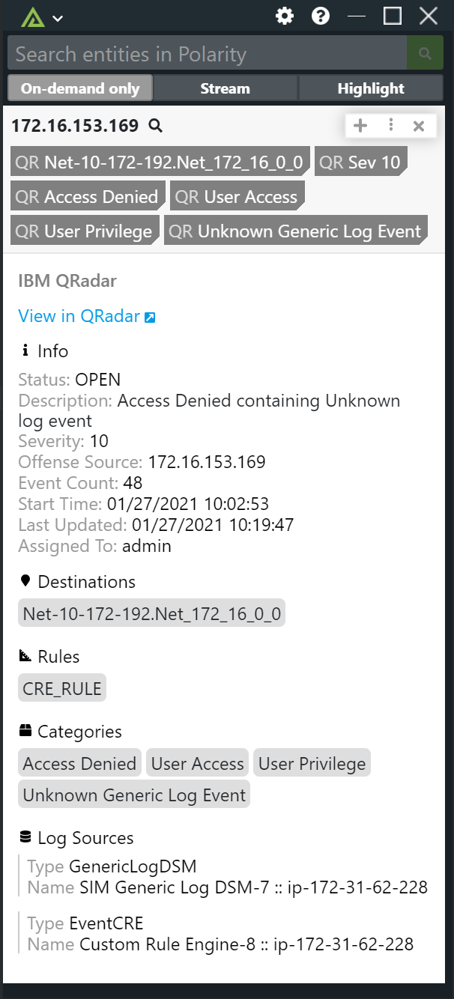

# Polarity IBM QRadar Integration

Polarity's IBM QRadar integration allows automated IPv4 lookups against IBM QRadar's offense database.

To learn more about IBM QRadar, visit the [official website](https://www.ibm.com/us-en/marketplace/ibm-qradar-siem).

|  |
|---|
|*IBM QRadar Example* |

## IBM QRadar Integration Options

### IBM QRadar Server URL
The URL for your IBM QRadar server which should include the schema (i.e., http, https) and port if required

### Username
The username of the IBM QRadar user you want the integration to authenticate as. You must provide either a Username and Password or a Security Token.

### Password
The password for the provided username you want the integration to authenticate as. You must provide either a Username and Password or a Security Token.

### Security Token
Your IBM QRadar Security Token used for authentication. You must provide either a Username and Password or a Security Token.

### Ignore Private IPs
If enabled, private IPs (RFC 1918 addresses) will not be looked up (includes 127.0.0.1, 0.0.0.0, and 255.255.255.255)

### Minimum Severity Level
The minimum severity level required for indicators to be displayed

### Open Offenses Only
If set to true, only offenses with a status value of 'OPEN' will be searched

## Polarity

Polarity is a memory-augmentation platform that improves and accelerates analyst decision-making.  For more information about the Polarity platform please see: 

https://polarity.io/